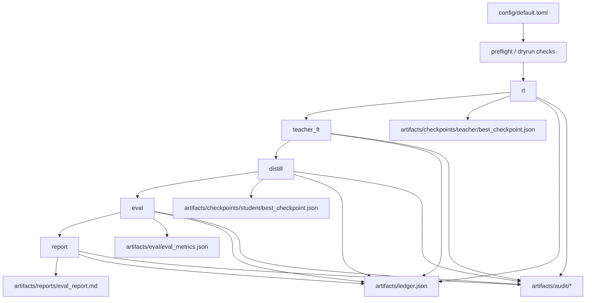

# RL + Teacher FT + Distillation

**Budget-gated RL -> Teacher FT -> Distillation pipeline with reproducible artifacts for local mock runs and Tinker-backed real runs.**

This repository orchestrates staged training/evaluation workflows with strict spend controls, schema-validated artifacts, and auditable run outputs under a state directory (typically `runs/run-###`).

---

## Core Capabilities

| Capability | What it does now | Source of truth |
| --- | --- | --- |
| Staged command pipeline | Runs `rl`, `teacher_ft`, `distill`, `eval`, `report`, `all`, `smoke`, `preflight`, `dryrun`, `campaign`, and `tune`. | `src/inference_projects/cli.py`, `src/inference_projects/pipeline.py` |
| Runtime adapter split | Uses deterministic local adapters in `mock` mode and Tinker-backed adapters in `real` mode. | `src/inference_projects/adapters.py` |
| Budget enforcement | Computes projected per-stage and total spend; enforces stage budgets and hard caps. | `src/inference_projects/budget.py`, `src/inference_projects/preflight.py`, `config/default.toml` |
| Ledger accounting | Writes cumulative spend/tokens and stage records to ledger artifacts. | `src/inference_projects/ledger.py`, `src/inference_projects/pipeline.py` |
| Artifact contracts | Validates checkpoint/eval/ledger/audit payloads against schema checks before write. | `src/inference_projects/schemas.py` |
| Audit bundle | Emits run manifest, per-stage audit payloads, eval row evidence, and an audit markdown report. | `src/inference_projects/audit.py`, `src/inference_projects/pipeline.py` |
| Campaign orchestration | Freezes prompt set, executes multi-seed runs, summarizes pooled metrics, supports early stop checks. | `src/inference_projects/campaign.py`, `src/inference_projects/pipeline.py` |
| Tuning support | Freezes prompt slices and creates/ranks/promotes teacher/distillation candidate sweeps. | `src/inference_projects/tuning.py`, `src/inference_projects/pipeline.py` |

## Pipeline Architecture & Data Flow

The pipeline executes stage commands in sequence and writes artifacts into a state directory.



- Orchestration entrypoint: `run_pipeline_command(...)` in `src/inference_projects/pipeline.py`.
- Adapter routing: `select_stage_adapters(mode)` in `src/inference_projects/adapters.py`.
- Commands `all`, `campaign`, and `tune` reuse the same config + state-dir model.

## Runtime Modes & Guardrails

| Mode | Behavior | Requirements |
| --- | --- | --- |
| `mock` | Uses deterministic local stage adapters for `rl`, `teacher_ft`, `distill`, and `eval`. | No external API credentials required. |
| `real` | Routes stage execution through Tinker runtime adapters and records provider usage metadata. | `TINKER_API_KEY` and `TINKER_BASE_URL` must be set. |

Guardrails currently enforced in code:
- `preflight` validates runtime mode, required env vars for `real`, and state-dir writability.
- `dryrun` reports projected stage and cumulative spend from `token_caps` + `token_rates_per_million`.
- Projection warnings are emitted when projected total is outside `runtime.projection_warning_min_usd` to `runtime.projection_warning_max_usd`.
- Campaign and tuning flows enforce strict run caps (`campaign.strict_run_cap`, `tuning.strict_run_cap`).
- Real-mode payloads must include required usage fields (`prefill_tokens`, `sample_tokens`, `train_tokens`, `run_id`, `provider_raw`) before ledger/audit writes.

## Runbook (Make + CLI)

### Setup

```bash
python3 -m venv .venv
source .venv/bin/activate
python3 -m pip install -e '.[dev]'
```

### Make Targets

```bash
make preflight MODE=mock
make dryrun MODE=mock
make rl MODE=mock
make teacher_ft MODE=mock
make distill MODE=mock
make eval MODE=mock
make report MODE=mock
make all MODE=mock
make campaign MODE=real CONFIG=config/default.toml STATE_DIR=/abs/path/to/state PRIOR_LEDGER=/abs/path/to/ledger.json
make tune MODE=mock
```

Convenience runners:

```bash
make run-dir
make all-run MODE=mock
make campaign-run MODE=real CONFIG=config/default.toml PROJECT_HARD_CAP_USD=35.0
```

### CLI Equivalents

```bash
STATE_DIR="$(python3 scripts/allocate_run_dir.py --root runs)"
python3 -m inference_projects.cli preflight --mode mock --config config/default.toml --state-dir "$STATE_DIR"
python3 -m inference_projects.cli dryrun --mode mock --config config/default.toml --state-dir "$STATE_DIR"
python3 -m inference_projects.cli all --mode mock --config config/default.toml --state-dir "$STATE_DIR"
python3 -m inference_projects.cli tune --mode mock --config config/default.toml --state-dir "$STATE_DIR"
```

Real mode setup:

```bash
set -a && source .env && set +a
STATE_DIR="$(python3 scripts/allocate_run_dir.py --root runs)"
python3 -m inference_projects.cli preflight --mode real --config config/default.toml --state-dir "$STATE_DIR"
python3 -m inference_projects.cli campaign --mode real --config config/default.toml --state-dir "$STATE_DIR" --project-hard-cap-usd 35.0
```

## Artifacts & Run Directory Model

_Work in progress in this commit: section scaffold only._

## Configuration Surface

_Work in progress in this commit: section scaffold only._

## Testing & Verification

_Work in progress in this commit: section scaffold only._

## Current Limitations

_Work in progress in this commit: section scaffold only._
