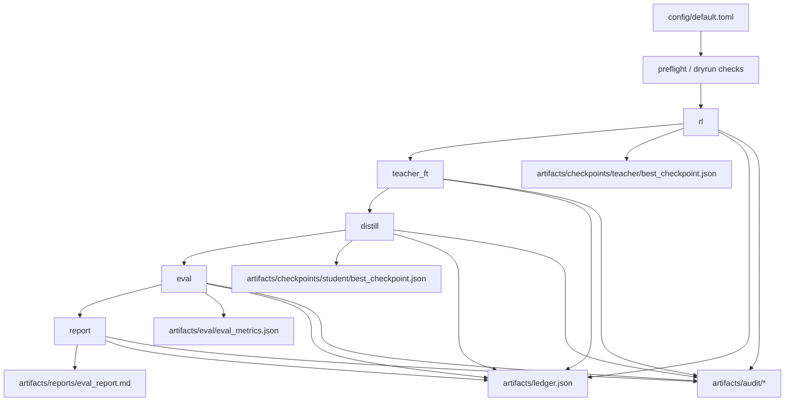

# RL + Teacher FT + Distillation

**RL -> Teacher FT -> Distillation pipeline with spend telemetry, reproducible artifacts, and support for local mock and Tinker-backed real runs.**

This repository orchestrates staged training/evaluation workflows with non-blocking spend telemetry, schema-validated artifacts, and auditable run outputs under a state directory (typically `runs/run-###`).

---

## Core Capabilities

| Capability | What it does now | Source of truth |
| --- | --- | --- |
| Staged command pipeline | Runs `rl`, `teacher_ft`, `distill`, `eval`, `report`, `all`, `smoke`, `preflight`, `dryrun`, `campaign`, and `tune`. | `src/inference_projects/cli.py`, `src/inference_projects/pipeline.py` |
| Runtime adapter split | Uses deterministic local adapters in `mock` mode and Tinker-backed adapters in `real` mode. | `src/inference_projects/adapters.py` |
| Budget telemetry | Computes projected per-stage/total spend and records realized stage spend in ledger/audit artifacts. | `src/inference_projects/budget.py`, `src/inference_projects/preflight.py`, `src/inference_projects/pipeline.py`, `config/default.toml` |
| Ledger accounting | Writes cumulative spend/tokens and stage records to ledger artifacts. | `src/inference_projects/ledger.py`, `src/inference_projects/pipeline.py` |
| Artifact contracts | Validates checkpoint/eval/ledger/audit payloads against schema checks before write. | `src/inference_projects/schemas.py` |
| Audit bundle | Emits run manifest, per-stage audit payloads, eval row evidence, and an audit markdown report. | `src/inference_projects/audit.py`, `src/inference_projects/pipeline.py` |
| Campaign orchestration | Freezes prompt set, executes multi-seed runs, summarizes pooled metrics, supports early stop checks. | `src/inference_projects/campaign.py`, `src/inference_projects/pipeline.py` |
| Tuning support | Freezes prompt slices and creates/ranks/promotes teacher/distillation candidate sweeps. | `src/inference_projects/tuning.py`, `src/inference_projects/pipeline.py` |

## Pipeline Architecture & Data Flow

The pipeline executes stage commands in sequence and writes artifacts into a state directory.



- Orchestration entrypoint: `run_pipeline_command(...)` in `src/inference_projects/pipeline.py`.
- Adapter routing: `select_stage_adapters(mode)` in `src/inference_projects/adapters.py`.
- Commands `all`, `campaign`, and `tune` reuse the same config + state-dir model.

## Runtime Modes & Guardrails

| Mode | Behavior | Requirements |
| --- | --- | --- |
| `mock` | Uses deterministic local stage adapters for `rl`, `teacher_ft`, `distill`, and `eval`. | No external API credentials required. |
| `real` | Routes stage execution through Tinker runtime adapters and records provider usage metadata. | `TINKER_API_KEY` and `TINKER_BASE_URL` must be set. |

Guardrails currently enforced in code:
- `preflight` validates runtime mode, required env vars for `real`, and state-dir writability.
- `dryrun` reports projected stage and cumulative spend from `token_caps` + `token_rates_per_million`.
- Stage token budget caps and strict run caps are hard guardrails that block execution when exceeded.
- Projection warning bands and prompt-limit fields remain informational telemetry inputs.
- Real-mode payloads must include required usage fields (`prefill_tokens`, `sample_tokens`, `train_tokens`, `run_id`, `provider_raw`) before ledger/audit writes.

## Runbook (Make + CLI)

### Setup

```bash
python3 -m venv .venv
source .venv/bin/activate
python3 -m pip install -e '.[dev]'
```

### Quickstart (Mock Mode)

```bash
STATE_DIR="$(python3 scripts/allocate_run_dir.py --root runs)"
python3 -m inference_projects.cli preflight --mode mock --config config/default.toml --state-dir "$STATE_DIR"
python3 -m inference_projects.cli all --mode mock --config config/default.toml --state-dir "$STATE_DIR"
```

### Make Targets

```bash
make preflight MODE=mock
make dryrun MODE=mock
make rl MODE=mock
make teacher_ft MODE=mock
make distill MODE=mock
make eval MODE=mock
make report MODE=mock
make all MODE=mock
make campaign MODE=real CONFIG=config/default.toml STATE_DIR=/abs/path/to/state
make tune MODE=mock
```

Convenience runners:

```bash
make run-dir
make all-run MODE=mock
make campaign-run MODE=real CONFIG=config/default.toml
```

### CLI Equivalents

```bash
STATE_DIR="$(python3 scripts/allocate_run_dir.py --root runs)"
python3 -m inference_projects.cli preflight --mode mock --config config/default.toml --state-dir "$STATE_DIR"
python3 -m inference_projects.cli dryrun --mode mock --config config/default.toml --state-dir "$STATE_DIR"
python3 -m inference_projects.cli all --mode mock --config config/default.toml --state-dir "$STATE_DIR"
python3 -m inference_projects.cli tune --mode mock --config config/default.toml --state-dir "$STATE_DIR"
```

Real mode setup:

```bash
set -a && source .env && set +a
STATE_DIR="$(python3 scripts/allocate_run_dir.py --root runs)"
python3 -m inference_projects.cli preflight --mode real --config config/default.toml --state-dir "$STATE_DIR"
python3 -m inference_projects.cli campaign --mode real --config config/real_canary_phase1.toml --state-dir "$STATE_DIR" \
  2>&1 | tee "$STATE_DIR/phase1_campaign.log"
```

Phase 1 recommendation:
- Prefer `campaign` with `config/real_canary_phase1.toml` for canary retries, watchdog telemetry, and structured failure handling.
- Capture both stdout and stderr to per-run logs with `2>&1 | tee ...` for postmortem analysis.

## Artifacts & Run Directory Model

The pipeline writes state into the provided `--state-dir`. Typical usage allocates a new directory under `runs/run-###`.

Single-run artifact layout:

- `artifacts/checkpoints/teacher/best_checkpoint.json`
- `artifacts/checkpoints/student/best_checkpoint.json`
- `artifacts/eval/eval_metrics.json`
- `artifacts/reports/eval_report.md`
- `artifacts/ledger.json`

Audit bundle (written during staged runs):

- `artifacts/audit/run_manifest.json`
- `artifacts/audit/stage_rl.json`
- `artifacts/audit/stage_teacher_ft.json`
- `artifacts/audit/stage_distill.json`
- `artifacts/audit/stage_eval.json`
- `artifacts/audit/eval_rows.jsonl`
- `artifacts/reports/run_audit_report.md`

Campaign outputs:

- `campaign/frozen_prompts.jsonl`
- `campaign/campaign_summary.json`
- `campaign/campaign_report.md`

Tune outputs:

- `tuning/frozen_prompts_stage2.jsonl`
- `tuning/frozen_stage1_slices/slice_*.jsonl`
- `tuning/sweeps/teacher/...`
- `tuning/sweeps/distill/...`
- `tuning/final_campaign/...` (when final campaign step executes)
- `tuning/tune_summary.json`

## Configuration Surface

Primary config file: `config/default.toml`.

| Section | Active fields used by runtime |
| --- | --- |
| `[project]` | `name`, `seed` |
| `[token_rates_per_million]` | `prefill`, `sample`, `train` |
| `[token_caps]` | Stage token caps for `rl`, `teacher_ft`, `distill`, `eval` |
| `[models]` | `teacher`, `student`, `baseline` |
| `[runtime]` | `default_mode`, projection telemetry fields, `real_required_env`, retry/poll settings |
| `[evaluation]` | Prompt fixture path, concurrency, eval token/temperature controls, integrity thresholds |
| `[distillation]` | Distillation/training hyperparameters used by tune/distill flow |
| `[campaign]` | Seed list, run bounds, bootstrap reps, early-stop threshold |
| `[tuning]` | Candidate sweep width, acceptance gates, and promotion controls |

Canary profile for smaller real-mode runs: `config/real_canary.toml`.

## Testing & Verification

```bash
make test
make verify
```

What is covered:
- Unit and integration tests across adapters, CLI dispatch, pipeline orchestration, preflight, campaign logic, tuning logic, schemas, and report generation.
- Golden report fixture checks in `tests/test_golden_report.py`.
- Local quality gate script in `scripts/verify_local.sh`.

Recommended quick doc sanity checks after README edits:

```bash
rg -n \"planned|PPO|GRPO|DPO\" README.md
rg -n \"tune|campaign|preflight|dryrun\" README.md
```

## Current Limitations

- This is an orchestration and evaluation harness; it does not ship a full standalone training infrastructure stack.
- `real` mode depends on reachable Tinker services and valid credentials.
- Default smoke behavior runs only the `rl` stage (`smoke` command).
- This README documents current behavior only and omits roadmap sections by design.
