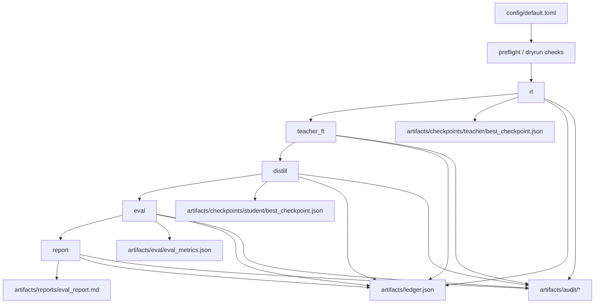

# RL + Teacher FT + Distillation

**Budget-gated RL -> Teacher FT -> Distillation pipeline with reproducible artifacts for local mock runs and Tinker-backed real runs.**

This repository orchestrates staged training/evaluation workflows with strict spend controls, schema-validated artifacts, and auditable run outputs under a state directory (typically `runs/run-###`).

---

## Core Capabilities

| Capability | What it does now | Source of truth |
| --- | --- | --- |
| Staged command pipeline | Runs `rl`, `teacher_ft`, `distill`, `eval`, `report`, `all`, `smoke`, `preflight`, `dryrun`, `campaign`, and `tune`. | `src/inference_projects/cli.py`, `src/inference_projects/pipeline.py` |
| Runtime adapter split | Uses deterministic local adapters in `mock` mode and Tinker-backed adapters in `real` mode. | `src/inference_projects/adapters.py` |
| Budget enforcement | Computes projected per-stage and total spend; enforces stage budgets and hard caps. | `src/inference_projects/budget.py`, `src/inference_projects/preflight.py`, `config/default.toml` |
| Ledger accounting | Writes cumulative spend/tokens and stage records to ledger artifacts. | `src/inference_projects/ledger.py`, `src/inference_projects/pipeline.py` |
| Artifact contracts | Validates checkpoint/eval/ledger/audit payloads against schema checks before write. | `src/inference_projects/schemas.py` |
| Audit bundle | Emits run manifest, per-stage audit payloads, eval row evidence, and an audit markdown report. | `src/inference_projects/audit.py`, `src/inference_projects/pipeline.py` |
| Campaign orchestration | Freezes prompt set, executes multi-seed runs, summarizes pooled metrics, supports early stop checks. | `src/inference_projects/campaign.py`, `src/inference_projects/pipeline.py` |
| Tuning support | Freezes prompt slices and creates/ranks/promotes teacher/distillation candidate sweeps. | `src/inference_projects/tuning.py`, `src/inference_projects/pipeline.py` |

## Pipeline Architecture & Data Flow

The pipeline executes stage commands in sequence and writes artifacts into a state directory.

- Orchestration entrypoint: `run_pipeline_command(...)` in `src/inference_projects/pipeline.py`.
- Adapter routing: `select_stage_adapters(mode)` in `src/inference_projects/adapters.py`.
- Commands `all`, `campaign`, and `tune` reuse the same config + state-dir model.

## Runtime Modes & Guardrails

_Work in progress in this commit: section scaffold only._

## Runbook (Make + CLI)

_Work in progress in this commit: section scaffold only._

## Artifacts & Run Directory Model

_Work in progress in this commit: section scaffold only._

## Configuration Surface

_Work in progress in this commit: section scaffold only._

## Testing & Verification

_Work in progress in this commit: section scaffold only._

## Current Limitations

_Work in progress in this commit: section scaffold only._
