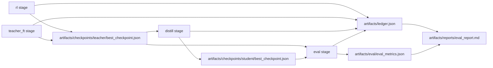

# RL + Teacher FT + Distillation: Beginner Full Codebase Guide (`explain.md`)

This guide explains the **entire runnable codebase** for this repository in beginner-friendly language.

It covers:
- what the project does
- how data flows through it
- why each technology/pattern was chosen
- alternatives and tradeoffs
- how to run it safely
- how to extend it

It intentionally excludes the `documentation/` folder, because those files are external cluster/how-to notes and are not imported by the Python package runtime.

---

## 1) What This Project Is

At a high level, this repository is a **training-and-evaluation pipeline simulator + integration harness**.

It models a sequence of ML workflow stages:
1. `rl` (reinforcement-learning-style teacher improvement)
2. `teacher_ft` (further teacher fine-tuning)
3. `distill` (teacher -> student compression)
4. `eval` (quality/cost/stability evaluation)
5. `report` (human-readable markdown summary)

Even though the names come from real ML workflows, this codebase is mostly about:
- **workflow orchestration**
- **budget guardrails**
- **artifact contracts/schemas**
- **mode-based adapter abstraction** (`mock` vs `real`)

### What “RL”, “Teacher FT”, and “distillation” mean here

- **RL (Reinforcement Learning)** in this repository means “teacher model improvement stage.”
  - In `mock` mode, this is deterministic fake output.
  - In `real` mode, it uses Tinker APIs to create/save a checkpoint and sample outputs.

- **Teacher FT (distributed sharding)** in this repository means “second teacher training stage.”
  - It is represented as a stage label and payload evolution.
  - The current implementation is integration-focused, not a full production distributed training stack.

- **Distillation** means creating a smaller student model guided by teacher behavior.
  - In `mock`, values are deterministic.
  - In `real`, teacher outputs are sampled and student checkpoint is created.

### What this project is *not*

- Not a production ML platform
- Not a full experiment tracker
- Not an infrastructure provisioning system
- Not deeply algorithmic RL research code (it does not implement full PPO/GRPO stacks)

---

## 2) How To Read This Guide

If you are new, read in this order:
1. Sections 3, 4, and 6 (structure, tech choices, config)
2. Section 7 (pipeline lifecycle)
3. Section 8 (module deep dive)
4. Sections 9 and 10 (mode differences + schema contracts)
5. Section 12 (operational runbook)
6. Section 13 (extension guide)

### Prerequisites

You should know only basic Python and command-line usage.
Anything ML-specific is explained in simplified terms as it appears.

---

## 3) Repository Map

## Top-level structure

- `src/inference_projects/`
  - Core application code
- `tests/`
  - Unit + integration-style tests
- `config/`
  - TOML runtime configs (`default` and `real_canary`)
- `scripts/`
  - Local verification script
- `Makefile`
  - Convenience command wrappers
- `pyproject.toml`
  - Package/build/dependency metadata
- `README.md`
  - High-level project overview
- `artifacts/`
  - Output directory (at runtime, or under custom `--state-dir`)

### Important top-level files and why they exist

- `pyproject.toml`
  - Defines Python package metadata and dependencies
  - Chosen modern standard for Python packaging
- `Makefile`
  - Fast command aliases for developer ergonomics
- `README.md`
  - Project entrypoint documentation

### Runtime artifact layout

When pipeline stages run, these files are produced:
- `artifacts/checkpoints/teacher/best_checkpoint.json`
- `artifacts/checkpoints/student/best_checkpoint.json`
- `artifacts/eval/eval_metrics.json`
- `artifacts/ledger.json`
- `artifacts/reports/eval_report.md`

---

## 4) Tech Stack and Why

### Language/runtime

- **Python 3.11+**
  - Why: simple, fast iteration, good tooling, and uses stdlib `tomllib`
  - Alternative: Python 3.10 + `tomli` backport
  - Tradeoff: strict minimum Python version

### Config format

- **TOML** (`config/*.toml`)
  - Why: readable + typed enough for numeric configs
  - Alternatives: YAML, JSON, env-only config
  - Tradeoff:
    - TOML is less ubiquitous than YAML
    - JSON is less readable for comments/ops tuning

### Data modeling

- **`dataclasses`** for in-process models (`ProjectConfig`, `Ledger`, `StageRecord`, etc.)
  - Why: lightweight, explicit, stdlib, easy to reason about
  - Alternatives: Pydantic models, namedtuple, plain dicts
  - Tradeoff:
    - less runtime validation than Pydantic
    - requires separate validation layer (which this repo has in `schemas.py`)

### Command-line interface

- **`argparse`** in `cli.py`
  - Why: stdlib, zero dependency, straightforward
  - Alternatives: Click/Typer
  - Tradeoff: less ergonomic advanced CLI UX than Typer/Click

### Testing

- **pytest**
  - Why: concise assertions, fixtures, monkeypatch support
  - Alternatives: unittest
  - Tradeoff: adds dependency (though standard in Python ecosystems)

### Build/dev workflow

- **Makefile + shell script**
  - Why: stable command shortcuts and reproducible local checks
  - Alternatives: task runner tools (just, tox, nox, invoke)
  - Tradeoff: requires `make` familiarity

### External integration

- **Tinker SDK** (`tinker==0.16.1`)
  - Why: typed interface for training/sampling/checkpoint APIs
  - Alternatives: raw HTTP client, custom internal wrapper only
  - Tradeoff: SDK API shape changes can affect integration code

---

## 5) Alternatives and Tradeoffs (Architecture-Level)

### Pattern: Adapter-by-mode (`mock` vs `real`)

Current design:
- stage logic is abstracted by adapter protocols
- `select_stage_adapters(mode)` chooses mock or real implementation

Why used:
- isolates external-service complexity from orchestration
- makes tests deterministic in mock mode
- lets pipeline logic stay stable while integration evolves

Alternatives:
1. `if mode == ...` blocks directly in `pipeline.py`
2. separate executables for mock and real
3. plugin system with dynamic loading

Tradeoffs:
- Current adapter pattern improves testability and separation
- But adds indirection for beginners

### Pattern: Schema validation at artifact boundaries

Current design:
- validate teacher/student/eval/ledger payloads before writing

Why used:
- catches malformed data early
- protects report generation and downstream consumers

Alternatives:
- no validation (faster, riskier)
- full typed runtime models with strict serialization (e.g., Pydantic)

Tradeoffs:
- Current approach is explicit and simple but manual

### Pattern: Budget guardrails as first-class logic

Current design:
- preflight and runtime stage checks against per-stage + hard cap

Why used:
- cost control is a product requirement
- makes pipeline safer for real external calls

Alternatives:
- post-hoc spend analysis only
- best-effort warnings without hard failures

Tradeoffs:
- strict guardrails can block runs unless config is tuned

---

## 6) Configuration Model (`config/default.toml`, `config/real_canary.toml`)

Two main configs exist:
- `config/default.toml`
  - normal profile
- `config/real_canary.toml`
  - lower-cost first real-run profile

### Config sections

1. `[project]`
- project name
- random seed

2. `[budget]`
- `target_cap_usd`: preferred budget
- `hard_cap_usd`: absolute maximum (enforced)

3. `[stage_budgets_usd]`
- per-stage caps (`rl`, `teacher_ft`, `distill`, `eval`)

4. `[token_rates_per_million]`
- price multipliers for token categories

5. `[token_caps]`
- projected token volume by stage and token type

6. `[models]`
- teacher/student/baseline model IDs

7. `[runtime]`
- default mode (`mock`/`real`)
- warning range for projected spend
- required env vars for real mode
- polling interval and timeout for real integrations

### How cost projection works

Cost formula (in `pricing.py`):

`cost = prefill/1e6 * prefill_rate + sample/1e6 * sample_rate + train/1e6 * train_rate`

This formula is used for:
- projected stage cost
- projected total cost
- real-mode fallback actual cost when provider cost is absent and only usage tokens are available

### Why two config files

- `default.toml` is the normal baseline
- `real_canary.toml` is safer for first real execution (smaller token caps, lower projected spend)

Alternative:
- one config + many CLI overrides

Tradeoff:
- two files add maintenance overhead, but reduce run-time mistakes

---

## 7) Pipeline Lifecycle (Commands, Flow, Artifacts)

The entrypoint is `run_pipeline_command(...)` in `pipeline.py`, invoked by CLI.

Supported commands:
- `preflight`
- `dryrun`
- `rl`
- `teacher_ft`
- `distill`
- `eval`
- `report`
- `all`
- `smoke`

### Required diagram 1: Pipeline control/data flow

```mermaid
flowchart TD
  A["CLI: python -m inference_projects.cli <command>"] --> B["load_config(...)"]
  B --> C{"command"}

  C -->|preflight| P1["run_preflight()"]
  C -->|dryrun| D1["_dryrun_summary()"]

  C -->|stage/all| PR["ensure_preflight_ready()"]
  PR --> SEL["select_stage_adapters(mode)"]

  SEL --> RL["run_rl()"]
  RL --> Teacher FT["run_teacher_ft()"]
  Teacher FT --> DIST["run_distill()"]
  DIST --> EVAL["run_eval()"]
  EVAL --> RPT["run_report()"]

  RL --> TCKPT["teacher checkpoint JSON"]
  Teacher FT --> TCKPT
  DIST --> SCKPT["student checkpoint JSON"]
  EVAL --> EM["eval_metrics JSON"]

  RL --> LGR["ledger.json update"]
  Teacher FT --> LGR
  DIST --> LGR
  EVAL --> LGR

  LGR --> RPT
  EM --> RPT
```

### Command behavior summary

- `preflight`
  - checks budgets, mode validity, env vars (in real mode), and state-dir writability
- `dryrun`
  - reports projected spend only (no artifacts)
- stage commands (`rl`, `teacher_ft`, `distill`, `eval`)
  - execute one stage and update artifacts + ledger
- `report`
  - renders markdown report from existing ledger + eval metrics
- `all`
  - runs all stages in sequence then report
- `smoke`
  - minimal path (currently runs `rl`)

### Stage execution pattern in `pipeline.py`

For each stage:
1. run budget checks on projected spend (`_stage_budget_check`)
2. call adapter
3. resolve actual usage/cost
   - `mock`: deterministic factors
   - `real`: parse `_usage` payload from adapter
4. append stage record to ledger
5. validate output payload schema
6. write artifact JSON

### Required diagram 2: Artifact dependency graph



---

## 8) Module-by-Module Deep Dive (`src/inference_projects`)

This section explains each module: what it does, key API, inputs/outputs, why it is used, alternatives, and beginner pitfalls.

### `cli.py`

What it does:
- defines CLI parser and maps CLI args to `run_pipeline_command`

Key functions:
- `build_parser()`
- `main()`

Inputs/outputs:
- input: command + optional `--mode`, `--config`, `--state-dir`
- output: printed JSON for `preflight`/`dryrun`; exit code 2 when preflight fails

Why this design:
- keeps CLI thin and orchestration centralized in `pipeline.py`

Alternatives:
- richer CLI framework (Typer)

Beginner pitfalls:
- confusing default mode (`--mode` omitted uses config default)

---

### `pipeline.py`

What it does:
- orchestrates command lifecycle end-to-end
- enforces budget checks
- validates payloads
- writes artifacts and report

Key types/functions:
- `PipelinePaths`
- `run_pipeline_command`
- `run_rl`, `run_teacher_ft`, `run_distill`, `run_eval`, `run_report`
- `_real_usage_from_payload` for real-mode accounting

Inputs/outputs:
- inputs: config, mode, stage command, adapter outputs
- outputs: artifact JSON files + ledger + markdown report

Why this design:
- one central orchestration module makes control flow easy to audit

Alternatives:
- split each stage to independent command modules
- workflow engine/orchestrator (Airflow/Prefect)

Beginner pitfalls:
- real adapter payloads must include `_usage` with required keys
- `preflight` passing does not guarantee real provider API calls will always succeed

---

### `preflight.py`

What it does:
- validates “can we run?” conditions before execution

Key types/functions:
- `PreflightResult`
- `run_preflight`
- `ensure_preflight_ready`
- `SetupError`

Checks include:
- stage budget checks
- cumulative hard-cap feasibility
- warning-band notice
- writable state dir
- required env vars in real mode

Why this design:
- fail fast before expensive or partial runs

Alternatives:
- lazy failures during execution only

Beginner pitfalls:
- warning-band mismatch is not a failure
- missing env vars fail immediately for real mode

---

### `config.py`

What it does:
- loads TOML config and validates it into typed dataclasses

Key types/functions:
- `ProjectConfig`, `BudgetConfig`, `RuntimeConfig`
- `REQUIRED_STAGES`
- `load_config`
- validation helpers (`_validate_budget`, `_validate_runtime`)

Why this design:
- typed config object simplifies downstream code

Alternatives:
- pass dicts everywhere
- env-only configuration

Beginner pitfalls:
- `stage_budgets` sum must be >= target cap
- `default_mode` must be `mock` or `real`
- polling values must be positive

---

### `adapters.py`

What it does:
- defines stage adapter protocols and concrete mock/real adapters

Key types/functions:
- `RLStageAdapter`, `TeacherFTStageAdapter`, `DistillStageAdapter`, `EvalStageAdapter`
- `Mock*Adapter` classes
- `Real*Adapter` classes
- `select_stage_adapters(mode)`

Why this design:
- strategy pattern for swappable stage behavior by mode

Alternatives:
- mode conditionals in each stage function

Beginner pitfalls:
- real adapters include `_usage` metadata for pipeline accounting

---

### `tinker_runtime.py`

What it does:
- encapsulates Tinker SDK operations for real mode
- loads canary prompts
- manages checkpoint creation/continuation and sampling
- computes real-mode evaluation metrics and usage payloads

Key concepts:
- `REAL_USAGE_KEY = "_usage"`
- `PromptRow`, `SamplingBatch`, `TrainingCheckpoint`
- `run_real_rl`, `run_real_teacher_ft`, `run_real_distill`, `run_real_eval`

Why this design:
- keeps external integration complexity out of `adapters.py` and `pipeline.py`

Alternatives:
- put raw Tinker calls directly in adapters
- separate microservice for integration

Beginner pitfalls:
- canary fixture must exist and be non-empty
- real sampling requires tokenizer-based prompt encoding
- checkpoint polling can timeout if provider is slow/unavailable

---

### `budget.py`

What it does:
- projection math + budget boundary enforcement

Key functions:
- `projected_stage_cost_usd`
- `projected_total_cost_usd`
- `ensure_within_stage_budget`
- `ensure_within_hard_cap`

Why this design:
- single budget logic location avoids duplicated checks

Alternatives:
- inline cost checks in pipeline

Beginner pitfalls:
- hard cap check uses `current_total + incoming_cost`

---

### `pricing.py`

What it does:
- defines token usage type and cost formula

Key items:
- `TokenUsage` dataclass
- `cost_usd(...)`

Why this design:
- isolates one pricing formula used everywhere

Alternatives:
- ad-hoc calculations in each stage

Beginner pitfalls:
- units are “per million tokens,” not per token

---

### `ledger.py`

What it does:
- persistent run accounting model

Key types/functions:
- `StageRecord`
- `Ledger`
- `load_ledger`, `save_ledger`, `add_record`, `new_ledger`

Why this design:
- append-only-ish record model makes stage spend auditable

Alternatives:
- database table
- one big report-only object

Beginner pitfalls:
- stage spend and totals are rounded to 4 decimals

---

### `schemas.py`

What it does:
- validates required artifact keys and nested structure

Key validators:
- `validate_teacher_checkpoint`
- `validate_student_checkpoint`
- `validate_eval_metrics`
- `validate_ledger_payload`

Why this design:
- catches malformed payloads before writing/reporting

Alternatives:
- rely on implicit assumptions
- enforce with external schema library (JSONSchema/Pydantic)

Beginner pitfalls:
- validators enforce required keys, but allow extra keys

---

### `style_checks.py`

What it does:
- lightweight style checker for trailing spaces and tab characters

Key functions:
- `collect_python_files`
- `run_style_checks`

Why this design:
- fast baseline hygiene without full linter setup

Alternatives:
- Ruff/Flake8/Black pre-commit pipeline

Beginner pitfalls:
- checks only `src/**/*.py` and `tests/**/*.py`

---

### `__init__.py`

What it does:
- package marker + exports `budget`

Why this design:
- minimal package surface

Alternative:
- expose more modules at package root

Pitfall:
- beginners may expect all modules to be exported from root; they are not.

---

## 9) Mock vs Real Mode Internals

| Dimension | `mock` mode | `real` mode |
|---|---|---|
| Adapter behavior | deterministic local payloads | Tinker-backed integration calls |
| External dependencies | none | requires env + Tinker connectivity |
| Actual tokens/cost | simulated using per-stage factors | taken from `_usage` metadata returned by real adapters |
| Cost calculation | deterministic formula | provider cost if supplied, otherwise formula from measured tokens |
| Primary use | tests/demo/reproducibility | live canary and real execution |

### Real mode required env vars
- `TINKER_API_KEY`
- `TINKER_BASE_URL`

### Real mode accounting contract

Real adapter payloads must include:
- `_usage.prefill_tokens` (int)
- `_usage.sample_tokens` (int)
- `_usage.train_tokens` (int)
- `_usage.cost_usd` (number or null)
- `_usage.provider_raw` (object)
- `_usage.run_id` (string)

If missing, pipeline raises `RuntimeError`.

---

## 10) Data Contracts / Schemas

Schema version currently used in artifacts: `1.0`.

### Teacher checkpoint (`validate_teacher_checkpoint`)

Required keys:
- `schema_version: str`
- `mode: str`
- `model: str`
- `stage: str`
- `quality_score: number`
- `stability_score: number`

### Student checkpoint (`validate_student_checkpoint`)

Required keys:
- `schema_version: str`
- `mode: str`
- `teacher_model: str`
- `student_model: str`
- `teacher_quality: number`
- `student_quality: number`
- `compression_ratio: number`
- `stability_score: number`

### Eval metrics (`validate_eval_metrics`)

Required top-level keys:
- `schema_version`, `mode`, `quality`, `cost`, `training_stability`

Required nested keys:
- `quality.benchmark`: `baseline`, `teacher`, `student`, `student_retention_vs_teacher`
- `quality.llm_judge`: `student_vs_baseline_win_rate`, `student_vs_teacher_win_rate`
- `cost.inference_usd_per_1k_tokens`: `teacher`, `student`, `student_savings_pct`

### Ledger (`validate_ledger_payload`)

Required top-level keys:
- `schema_version`
- `total_spend_usd`
- `stage_spend_usd`
- `token_totals`
- `records`

Each record requires:
- `mode`, `stage`, `projected_cost_usd`, `actual_cost_usd`
- `projected_tokens`, `actual_tokens`
- `status`

---

## 11) Testing Strategy (`tests/`)

The tests combine unit checks and integration-style workflow checks.

### Test file guide

- `tests/test_cli.py`
  - parser correctness for command and flags

- `tests/test_budget.py`
  - pricing projection math and budget boundary errors

- `tests/test_preflight.py`
  - warning behavior and unsupported mode handling

- `tests/test_config_validation.py`
  - invalid config rejection + canary config load

- `tests/test_schemas.py`
  - required key enforcement in validators

- `tests/test_adapters.py`
  - adapter selection + real adapter mocked behavior + usage metadata presence

- `tests/test_pipeline.py`
  - stage artifact creation, cap failures, dryrun behavior, real-mode usage ingestion/failure paths

- `tests/test_smoke_commands.py`
  - stage-by-stage mock execution sanity

- `tests/test_golden_report.py`
  - report text regression against fixture

- `tests/test_tinker_runtime.py`
  - canary prompt fixture and helper math behavior

### How to run tests

```bash
source .venv/bin/activate
pytest -q
```

### Why this test approach

- fast deterministic checks in `mock`
- targeted real-mode contract checks via mocking (not network-dependent)

Alternative:
- full end-to-end real network tests in CI

Tradeoff:
- current suite is reliable/fast, but does not fully validate live provider behavior on every run

---

## 12) Operational Guide (Beginner Safe)

### Setup

```bash
python3.11 -m venv .venv
source .venv/bin/activate
python -m pip install -e '.[dev]'
```

### Quick local verification

```bash
./scripts/verify_local.sh
```

This runs style checks, compile checks, tests, and mock-mode smoke checks.

### First real run (recommended canary)

```bash
set -a && source .env && set +a

python -m inference_projects.cli preflight --mode real --config config/real_canary.toml --state-dir /tmp/inference-real
python -m inference_projects.cli dryrun --mode real --config config/real_canary.toml --state-dir /tmp/inference-real

python -m inference_projects.cli rl --mode real --config config/real_canary.toml --state-dir /tmp/inference-real
python -m inference_projects.cli teacher_ft --mode real --config config/real_canary.toml --state-dir /tmp/inference-real
python -m inference_projects.cli distill --mode real --config config/real_canary.toml --state-dir /tmp/inference-real
python -m inference_projects.cli eval --mode real --config config/real_canary.toml --state-dir /tmp/inference-real
python -m inference_projects.cli report --mode real --config config/real_canary.toml --state-dir /tmp/inference-real
```

### Validate produced artifacts

- `/tmp/inference-real/artifacts/checkpoints/teacher/best_checkpoint.json`
- `/tmp/inference-real/artifacts/checkpoints/student/best_checkpoint.json`
- `/tmp/inference-real/artifacts/eval/eval_metrics.json`
- `/tmp/inference-real/artifacts/ledger.json`
- `/tmp/inference-real/artifacts/reports/eval_report.md`

### Common failure signatures and fixes

1. `Missing required environment variable for real mode`
- fix: set `TINKER_API_KEY` and `TINKER_BASE_URL`

2. `Projected total ... exceeds hard cap`
- fix: lower token caps or raise budget caps in config

3. `Real mode adapter payload missing required usage object '_usage'`
- fix: ensure real adapter returns usage metadata contract

4. `Required artifact missing`
- fix: run stages in order (`rl -> teacher_ft -> distill -> eval -> report`) or use `all`

5. `Timed out waiting for checkpoint`
- fix: increase `runtime.real_poll_timeout_seconds` or investigate provider-side status

6. Tinker billing/access errors (e.g., 402)
- fix: verify org billing balance and rotate/reload API key if needed

---

## 13) Extension Guide (How To Add Features Safely)

### A) Add a new stage (advanced)

Because stages are currently fixed (`REQUIRED_STAGES = ("rl", "teacher_ft", "distill", "eval")`), adding a stage touches many places.

You would need to update:
1. `config.py` (`REQUIRED_STAGES`, token cap parsing expectations)
2. `config/*.toml` (stage budgets and token caps)
3. `pipeline.py` (execution order, command routing, report sectioning)
4. `ledger.py` initial stage spend map
5. tests that assume exactly four stages

Beginner note:
- this is intentionally rigid to reduce accidental mismatch across config, budgets, and reports.

### B) Add new model/provider behavior

Safe path:
1. keep artifact schemas stable
2. add/change logic behind adapters or runtime integration helpers
3. preserve `_usage` contract for real mode
4. update tests for new behavior

### C) Improve real-mode evaluation quality

You can:
- expand prompt fixture (`src/inference_projects/fixtures/real_eval_prompts.jsonl`)
- replace overlap scoring in `tinker_runtime.py` with stronger rubric/judge logic
- keep required eval schema keys intact

### D) Improve developer quality gates

Possible improvements:
- replace/add `style_checks.py` with Ruff
- add type checking (mypy/pyright)
- add pre-commit hooks

---

## 14) Glossary (Beginner)

- **Adapter**: a swappable implementation behind a stable interface.
- **Artifact**: a file produced by a stage (checkpoint, metrics, ledger, report).
- **Baseline model**: comparison model used in evaluation.
- **Budget cap**: maximum allowed spend (stage-level or global).
- **Canary run**: small, low-risk first real run.
- **Checkpoint**: saved model state after training operations.
- **CLI**: command-line interface (`python -m inference_projects.cli ...`).
- **Dataclass**: Python decorator creating lightweight classes for structured data.
- **Distillation**: training a smaller student model from a larger teacher model.
- **Dry run**: projection-only command that does not create artifacts.
- **Teacher FT**: distributed sharding (here used as a stage label for additional teacher training).
- **Hard cap**: absolute maximum spend limit.
- **Ledger**: cumulative spend/token accounting file for all completed stages.
- **Mock mode**: deterministic local mode with no external service dependency.
- **Preflight**: checks run-readiness before executing costly stages.
- **Protocol (typing)**: interface contract for classes in Python typing.
- **Real mode**: integration mode using external Tinker services.
- **RL stage**: first teacher-improvement stage in this pipeline.
- **Schema validation**: required key/type checks before artifacts are written.
- **Seed**: fixed value for reproducibility when random behavior is involved.
- **TOML**: configuration file format used by this project.
- **Token usage**: tracked categories (`prefill`, `sample`, `train`) used for cost accounting.

---

## Final Beginner Checklist

If you want to be fully productive in this repository:
1. Understand config keys in `config/default.toml`
2. Understand stage order and artifacts
3. Know difference between `mock` and `real`
4. Run `pytest -q` and `scripts/verify_local.sh`
5. Run canary real pipeline stage-by-stage before full `all`
6. Keep schema contracts stable when changing logic

If you follow those six points, you can safely read, run, and extend this codebase.
